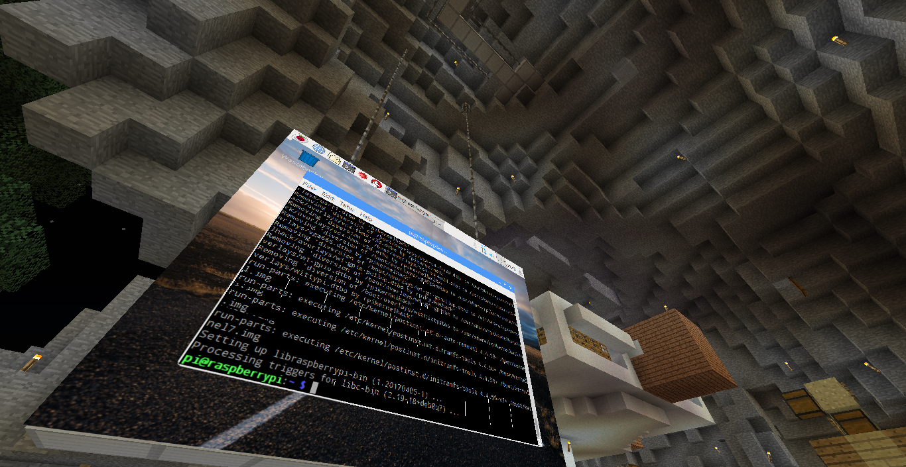

# mcrdp

An experimental Minecraft mod that displays a single RDP connection while in-game.

Powered by [properjavardp](http://properjavardp.sourceforge.net/) (specifically, [a tweaked version](https://github.com/Pokechu22/properjavardp)).

## Building and running

Right now, the build process isn't great.

1. Download my tweaked version of [properJavaRDP](https://github.com/Pokechu22/properjavardp).
2. Run `gradlew install` inside of properJavaRDP, to add it to your local maven repository.
3. Open `src/main/java/mcrdp/LiteModMcRdp.java`.  Find `init` and then edit the list of instances to values you want (map key is the name used on signs, and parameters to `RDPInstance.create` are `ip`, `username`, `password, `width`, and `height`)  - the defaults will not work for you.  (Right now, these aren't changable in game - that will change).
4. Run `gradlew runClient` inside of mcrdp.  ForgeGradle will spend a while setting up the workspace, and then the development launcher will start (you can choose "cancel" to enter offline mode).  Alternatively, run `gradlew build` to generate a 
6. See usage below for setting up an RDP display ingame.

## Usage

A sign containing the text `mcrdp` on the first line will activate a display.  The second line can contain the width and height in blocks, such as `1x1` (if not specified, `8x6` is assumed).  The fourth line contains the server name (a map key in `instances`).

## TODO

- [ ] Allow managing the list of servers and usernames/passwords ingame
- [x] Hide the RDP window when not needed  
    _(this window is no longer generated as properJavaRDP has been reworked)_
- [x] Some kind of ingame interaction with the computer instead of using a second window  
    _(work in progress, but mouse input works and shift+rightclick opens an ingame GUI)_
- [ ] Send info from the MC world to the connected system (with redstone?) - may not be possible  
    _(VChannels may be useful here)_
- [x] Bundle dependencies, so that it can be used as an actual mod  
    _(Still requires manual addition to a local maven repo)_
- [x] Allow multiple different RDP servers at once (needs major properJavaRDP changes)  
    _(This should work apart from some minor issues with keyboard input, probably)_
- [x] Fix graphical artifacts (properJavaRDP)  
    _(All known artifacts have been fixed)_
- [x] Fix properJavaRDP crashes due to `IndexOutOfBoundsException`s (properJavaRDP)  
    _(As far as I know this is fixed; it was related to resizing desktops)_
- [ ] Sound?  (properJavaRDP)  
    _(Will require a machine with functioning sound; right now xrdp does not seem to send audio so I cannot implement the audio VChannel)_

-----

_Demo connected to my raspberry pi, hanging in my old skyblock island_